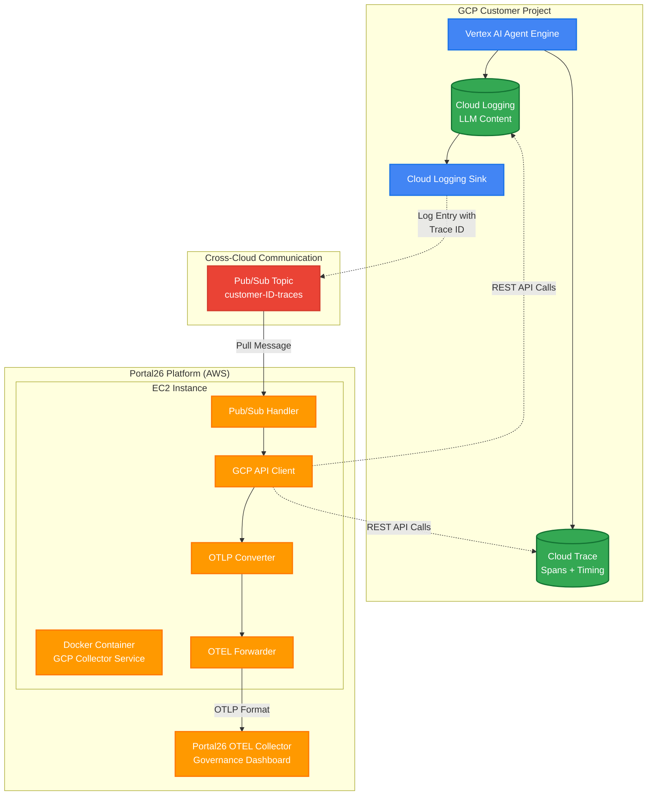

# Hybrid GCP Data Collection Architecture
**Portal26 AI Governance Platform - GCP Integration**

---

## What is This?

**Portal26** is an AI governance and observability platform that helps organizations monitor, audit, and govern their AI/LLM applications. This document describes how Portal26 collects observability data from **GCP Vertex AI Agent Engine** deployments.

### For Clients

When you use Vertex AI Agent Engine in GCP, you want visibility into:
- ✅ What prompts are being sent to LLMs
- ✅ What responses are being generated
- ✅ Performance metrics (latency, errors, costs)
- ✅ Compliance and audit trails

**Portal26 automatically collects this data** from your GCP project and provides it in a unified governance dashboard - with **zero code changes** to your agents.

---

## Overview

### Goal
**Enable complete AI governance observability by collecting both trace structure AND LLM content from GCP Vertex AI Agent Engine and forwarding to Portal26's OTEL-based observability platform.**

### Problem Statement
Current observability approaches have critical gaps:
- **Cloud Trace alone**: Contains span timing/structure but lacks actual LLM prompts/responses
- **Cloud Logging alone**: Contains LLM content but lacks trace context and relationships
- **Polling approaches**: 30-60 second latency, wasted API calls during idle periods

### Solution
Build an **event-driven hybrid collection system** that:
1. **Triggers instantly** when agent executions occur (via Cloud Logging sink → Pub/Sub)
2. **Collects complete data** from both Cloud Trace API (structure) + Cloud Logging API (content)
3. **Enriches traces** with LLM content to provide full observability picture
4. **Forwards to AWS** OTEL Collector in standard OTLP format for unified observability

### Key Outcome
**15-21 second end-to-end latency** from agent execution to complete observability data available in AWS platform, with zero customer infrastructure deployment required.

### Architecture Diagram



**Data Flow Summary:**
1. **Trigger**: Agent execution → Log entry → Pub/Sub notification (Real-time)
2. **Collection**: Portal26 service pulls both Cloud Trace API + Cloud Logging API (Complete data)
3. **Processing**: Correlate traces with logs, convert to OTLP (Enriched observability)
4. **Delivery**: Forward to Portal26 OTEL Collector (Governance platform)

---

## For Clients: Key Information

### What Data Does Portal26 Collect?

**From Cloud Trace API:**
- Trace IDs and span relationships
- Timing information (start/end times, duration)
- Operation names (e.g., "agent.reasoning_step", "llm.generate")
- Metadata attributes (model names, token counts)

**From Cloud Logging API:**
- LLM prompts sent to models
- LLM responses received
- Agent execution logs
- Error messages and stack traces

**What Portal26 Does NOT Collect:**
- ❌ Your application source code
- ❌ Customer PII (unless contained in your prompts)
- ❌ GCP credentials or secrets
- ❌ Non-AI-related application logs
- ❌ Infrastructure metrics unrelated to AI

### Data Collection Coverage Matrix

**What's monitored vs. what's not:**

| Data Type | Collected? | Source | Visibility in Portal26 |
|-----------|------------|--------|------------------------|
| **AI/LLM Data** |
| LLM prompts (user input) | ✅ Yes | Cloud Logging | Full text visible |
| LLM responses (model output) | ✅ Yes | Cloud Logging | Full text visible |
| Model name (e.g., gemini-2.5-flash) | ✅ Yes | Cloud Trace labels | Visible |
| Token counts (input/output) | ✅ Yes | Cloud Trace attributes | Visible |
| Latency (time per LLM call) | ✅ Yes | Cloud Trace spans | Visible as metrics |
| Error messages (LLM failures) | ✅ Yes | Cloud Logging | Visible |
| Agent reasoning steps | ✅ Yes | Cloud Trace spans | Visible as trace tree |
| Tool/function calls | ✅ Yes | Cloud Trace spans | Visible |
| Agent session IDs | ✅ Yes | Trace metadata | Visible |
| **Infrastructure** |
| GCP project ID | ✅ Yes | Resource labels | Visible |
| GCP region (e.g., us-central1) | ✅ Yes | Resource labels | Visible |
| Agent Engine ID | ✅ Yes | Resource labels | Visible |
| VM/compute metrics | ❌ No | N/A | Not collected |
| Network metrics | ❌ No | N/A | Not collected |
| Storage metrics | ❌ No | N/A | Not collected |
| **Application** |
| Your application code | ❌ No | N/A | Not collected |
| Application-specific logs | ❌ No | N/A | Only AI-related logs |
| Database queries | ❌ No | N/A | Not collected |
| API keys/secrets | ❌ No | N/A | Not collected |
| User credentials | ❌ No | N/A | Not collected |
| **Billing/Costs** |
| GCP billing data | ❌ No | N/A | Not collected |
| Vertex AI costs | ❌ No | N/A | Not collected |
| **Compliance** |
| Trace/log timestamps | ✅ Yes | Both sources | Audit trail available |
| User identifiers (if in prompts) | ⚠️ Maybe | Cloud Logging | Use PII redaction |
| Geographic location of requests | ❌ No | N/A | Only GCP region known |

**Legend:**
- ✅ Yes = Actively collected and visible in Portal26
- ❌ No = Not collected
- ⚠️ Maybe = Depends on your Agent implementation

**Important Notes:**
1. **PII in Prompts**: If your users' prompts contain PII (names, emails, etc.), that will be collected. Use Portal26's PII redaction feature or sanitize prompts before sending to LLM.
2. **Secrets in Logs**: Never log API keys or secrets. If accidentally logged, they will be collected. Rotate secrets immediately and contact Portal26 to purge.
3. **Scope**: Only logs/traces from `aiplatform.googleapis.com/ReasoningEngine` are collected - nothing else from your GCP project.

### Why Does Portal26 Need Access to My GCP Project?

**The Problem Portal26 Solves:**

Your Vertex AI Agent Engine generates two separate data sources:
1. **Cloud Trace** - Has span structure, timing, relationships (but NO actual LLM content)
2. **Cloud Logging** - Has LLM prompts, responses, content (but NO trace context)

**Neither source alone gives you complete AI governance visibility.** You need both to answer critical questions like:
- "What prompt led to this 30-second delay?" (need trace timing + log content)
- "Which model version generated this problematic response?" (need trace metadata + log response)
- "What was the full conversation flow that led to this error?" (need trace relationships + log content)

**Why Portal26 Can't Just Use One API:**

| Approach | What You Get | What You Miss | Governance Gap |
|----------|--------------|---------------|----------------|
| Cloud Trace API Only | Spans, timing, structure | ❌ Actual LLM prompts/responses | Can't audit what was actually said |
| Cloud Logging API Only | LLM content | ❌ Trace relationships, timing | Can't correlate events or measure performance |
| **Both APIs (Portal26)** | ✅ Complete picture | Nothing | ✅ Full AI governance |

**Why Portal26 Needs Cross-Project Access:**

Portal26 runs in AWS (not your GCP project) because:
1. ✅ **Zero infrastructure deployment** for you
2. ✅ **Multi-customer efficiency** - Portal26 manages one platform
3. ✅ **You maintain control** - revoke permissions anytime
4. ✅ **No code changes** - your agents don't need SDK integration

**Alternative Approaches (Why They Don't Work):**

| Alternative | Why It Doesn't Work |
|-------------|---------------------|
| "Run Portal26 in my GCP project" | Requires you to deploy/maintain infrastructure, costs more |
| "Use Cloud Trace export to BigQuery" | Only exports traces, missing log content; requires BigQuery setup |
| "Use Cloud Logging export" | Missing trace structure; delayed batch export (not real-time) |
| "Just use GCP Console manually" | Not scalable; no governance policies; no cross-customer comparison |
| "Build it ourselves" | 6-12 months engineering time; ongoing maintenance; lacks Portal26's AI governance features |

---

### What Permissions Are You Granting?

When you set up Portal26, you grant **read-only** access to:

| Permission | Purpose | Why Portal26 Needs This | Risk Level |
|------------|---------|------------------------|------------|
| `roles/cloudtrace.user` | Read trace structure, spans, timing, metadata | To get trace IDs, span relationships, latency metrics, model names | ✅ Low - Read only |
| `roles/logging.viewer` | Read AI agent logs with LLM prompts/responses | To get actual conversation content, prompts, responses, errors | ⚠️ Medium - Contains LLM content |
| Log Sink → Pub/Sub | Trigger real-time notifications when traces created | To know when to collect data (instead of polling every 5 seconds) | ✅ Low - Only sends trace IDs |

**Detailed Breakdown: What Each Permission Allows**

#### 1. `roles/cloudtrace.user` - Why This Is Needed
```yaml
API Calls Portal26 Makes:
  - GET /v1/projects/{your_project}/traces/{trace_id}
    Purpose: Fetch complete trace with all spans
    Frequency: Once per agent execution (triggered by Pub/Sub)
    Data Retrieved: 
      ✅ Span names (e.g., "agent.reasoning_step", "llm.generate")
      ✅ Start/end timestamps (to calculate latency)
      ✅ Parent-child relationships (to build trace tree)
      ✅ Attributes (model name, token counts, etc.)
    
Without This Permission:
  ❌ Cannot see agent execution flow
  ❌ Cannot measure performance/latency
  ❌ Cannot identify which model was used
  ❌ Cannot correlate logs to specific trace spans
```

#### 2. `roles/logging.viewer` - Why This Is Needed
```yaml
API Calls Portal26 Makes:
  - POST /v2/entries:list
    Filter: trace="{trace_id}" AND resource.type="aiplatform.googleapis.com/ReasoningEngine"
    Purpose: Get logs associated with specific trace
    Frequency: Once per agent execution (after getting trace)
    Data Retrieved:
      ✅ LLM prompts (user input, system instructions)
      ✅ LLM responses (model-generated content)
      ✅ Agent reasoning logs (intermediate steps)
      ✅ Error messages (failures, exceptions)
      ⚠️ May contain PII if in your prompts

Without This Permission:
  ❌ Cannot see what prompts were sent to LLM
  ❌ Cannot audit what responses were generated
  ❌ Cannot debug agent reasoning process
  ❌ No visibility into actual AI behavior
```

#### 3. Log Sink → Pub/Sub - Why This Is Needed
```yaml
How It Works:
  1. Your Agent executes → Creates log entry with trace ID
  2. Log Sink (in your project) matches filter
  3. Sink publishes message to Portal26's Pub/Sub topic
  4. Portal26 receives notification: "Hey, trace XYZ just happened"
  5. Portal26 calls APIs #1 and #2 above to fetch data

Data Sent to Portal26's Pub/Sub:
  ✅ Log entry metadata (timestamp, trace ID, resource labels)
  ✅ Severity level
  ✅ Resource type (confirms it's a ReasoningEngine)
  ❌ NOT the full log content (that's fetched separately via API)

Without This Permission:
  ❌ Portal26 must poll your project every 5-10 seconds
  ❌ Wastes API quota and costs
  ❌ 30-60 second latency (vs. 15-21 seconds with log sink)
  ❌ Collects data even when agents are idle
```

---

### What Portal26 Is NOT Allowed to Do

**You are NOT granting:**
- ❌ **Write access** - Portal26 cannot modify your data, create resources, or change configurations
- ❌ **Compute access** - Portal26 cannot run code, VMs, or containers in your project
- ❌ **Billing access** - Portal26 cannot see costs, modify budgets, or access billing data
- ❌ **IAM admin access** - Portal26 cannot change permissions, create service accounts, or modify policies
- ❌ **Secret access** - Portal26 cannot read Secret Manager, KMS keys, or credential stores
- ❌ **Network access** - Portal26 cannot modify VPCs, firewall rules, or networking
- ❌ **Storage access** - Portal26 cannot read GCS buckets, Cloud SQL databases, or other storage

**Verification: How to Confirm Limited Access**

After granting permissions, verify Portal26 only has what's needed:
```bash
# Check exact permissions granted
gcloud projects get-iam-policy {your_project} \
  --flatten="bindings[].members" \
  --filter="bindings.members:serviceAccount:portal26-collector@*" \
  --format="table(bindings.role)"

# Expected output (ONLY these two roles):
# roles/cloudtrace.user
# roles/logging.viewer
```

If you see any other roles, contact Portal26 immediately - you may have over-granted permissions.

### What Could Go Wrong?

**Scenario 1: Portal26 service goes down**
- **Impact**: New traces won't appear in Portal26 dashboard
- **Your agents**: Continue working normally (no impact)
- **Data loss**: Pub/Sub retains messages for 7 days, reprocessed when service recovers
- **Mitigation**: Portal26 SLA [99.9% uptime commitment]

**Scenario 2: You revoke permissions**
- **Impact**: Portal26 stops collecting data immediately
- **Your agents**: Continue working normally (no impact)
- **Historical data**: Remains in Portal26 (request deletion separately)

**Scenario 3: Rate limiting on GCP APIs**
- **Impact**: Some traces may be delayed or dropped
- **Your agents**: Not affected (Portal26 queries APIs, not in critical path)
- **Mitigation**: Portal26 implements exponential backoff and quotas

**Scenario 4: Sensitive data in prompts**
- **Impact**: PII/secrets in prompts will be visible in Portal26
- **Mitigation**: 
  - Use Portal26's PII redaction features
  - Implement prompt sanitization in your agents
  - Set up data retention policies

### Responsibility Matrix: Who Does What?

**Clear division of responsibilities between you (Customer) and Portal26:**

| Activity | Customer | Portal26 | Notes |
|----------|----------|----------|-------|
| **Setup Phase** |
| Enable GCP APIs (Trace, Logging) | ✅ Required | ❌ | One-time: 5 minutes |
| Grant IAM permissions to Portal26 | ✅ Required | ❌ | Read-only access |
| Create Cloud Logging sink | ✅ Required | ❌ | Points to Portal26 Pub/Sub |
| Provide Portal26 with sink writer identity | ✅ Required | ❌ | Copy/paste from console |
| Create Pub/Sub topic | ❌ | ✅ Done | In Portal26 project |
| Grant Pub/Sub publish permission | ❌ | ✅ Done | After you provide writer identity |
| Deploy/configure AWS collector | ❌ | ✅ Done | Portal26 infrastructure |
| Validate end-to-end data flow | 🤝 Shared | 🤝 Shared | Both parties verify |
| **Operations** |
| Run and maintain Agent Engine | ✅ Your responsibility | ❌ | Your application |
| Collect traces and logs | ❌ | ✅ Portal26 handles | Automated collection |
| Store observability data | ❌ | ✅ Portal26 handles | 90 days default |
| Provide governance dashboard | ❌ | ✅ Portal26 handles | Web UI access |
| Monitor collector service health | ❌ | ✅ Portal26 handles | 24/7 monitoring |
| Handle API rate limits | ❌ | ✅ Portal26 handles | Automatic backoff |
| Rotate service account credentials | ❌ | ✅ Portal26 handles | Automated rotation |
| Pay GCP API costs | ✅ Your GCP bill | ❌ | ~$1-5/month typically |
| Pay Portal26 service fees | ✅ Your Portal26 bill | ❌ | Per contract |
| **Troubleshooting** |
| Fix Agent Engine issues | ✅ Your responsibility | 🤝 Support available | Your application |
| Fix data collection issues | ❌ | ✅ Portal26 handles | Portal26 infrastructure |
| Investigate missing traces | 🤝 Shared | 🤝 Shared | May need both parties |
| Review security/compliance | 🤝 Shared | 🤝 Shared | DPA, audits |
| **Maintenance** |
| Keep Agent Engine updated | ✅ Your responsibility | ❌ | Your deployment |
| Update collector service | ❌ | ✅ Portal26 handles | Automatic updates |
| Renew IAM permissions | ✅ If needed | ❌ | Typically permanent |
| Review/adjust data retention | ✅ Configure in Portal26 | 🤝 Portal26 implements | Via dashboard settings |
| **Offboarding** |
| Revoke IAM permissions | ✅ Your action | ❌ | You control access |
| Delete Cloud Logging sink | ✅ Your action | ❌ | In your GCP project |
| Request data deletion | ✅ Your request | ✅ Portal26 executes | Within 30 days |
| Stop billing | 🤝 Automatic | 🤝 Automatic | When data stops flowing |

**Legend:**
- ✅ = Responsible party
- ❌ = Not responsible
- 🤝 = Shared responsibility

**Key Takeaway**: Portal26 handles all infrastructure, monitoring, and maintenance. You only need to grant read-only access and maintain your own Agent Engine.

---

### Quick Start: What Do I Need to Do?

**Time Required: ~30 minutes**

**Prerequisites:**
- ✅ GCP project with Vertex AI Agent Engine deployed
- ✅ `roles/owner` or `roles/iam.securityAdmin` on your GCP project
- ✅ Portal26 account and customer ID (provided by Portal26)
- ✅ `gcloud` CLI installed

**Setup Steps:**
1. **Enable GCP APIs** (5 minutes)
   ```bash
   gcloud services enable cloudtrace.googleapis.com logging.googleapis.com --project={your_project}
   ```

2. **Grant Portal26 read permissions** (5 minutes)
   - Give Portal26's service account read access to traces and logs
   - See detailed instructions in "Customer IAM Permissions Setup Guide" section below

3. **Create log sink** (10 minutes)
   - Set up automatic notification when agent traces are created
   - Points to Portal26's Pub/Sub topic

4. **Validate setup** (10 minutes)
   - Run a test agent execution
   - Verify data appears in Portal26 dashboard within 30 seconds

**That's it!** No code changes, no agent redeployment required.

---

## Architecture Components

### 1. GCP Data Sources (REST APIs)

#### Cloud Trace API
```
Endpoint: https://cloudtrace.googleapis.com/v1/projects/{project_id}/traces/{trace_id}
Purpose: Complete trace spans, timing, relationships, metadata
Authentication: OAuth2 Bearer token
Rate Limit: 300 requests/minute per project
```

#### Cloud Logging API  
```
Endpoint: https://logging.googleapis.com/v2/entries:list
Purpose: LLM content, prompts, responses, execution logs
Filter: trace="{trace_id}" AND resource.type="aiplatform.googleapis.com/ReasoningEngine"
Authentication: OAuth2 Bearer token
Rate Limit: 300 requests/minute per project
```

### 2. Event Trigger System

#### Cloud Logging Sink (Customer GCP Project)
```bash
gcloud logging sinks create governance-trace-sink \
  pubsub.googleapis.com/projects/{portal26_project}/topics/customer-{customer_id}-traces \
  --log-filter='resource.type="aiplatform.googleapis.com/ReasoningEngine" AND trace IS NOT NULL' \
  --project={customer_project}
```

#### Pub/Sub Topic (Governance Platform)
```
Topic: customer-{customer_id}-traces
Message Format: Cloud Logging entry with trace ID
Retention: 7 days
Delivery: Pull subscription
```

### 3. SaaS Data Collection Component

#### Docker Container Specification
```dockerfile
FROM python:3.11-slim

# Core dependencies
RUN pip install google-cloud-trace google-cloud-logging google-auth requests

# Application components
COPY src/ /app/
WORKDIR /app

# Health check endpoint
EXPOSE 8080
HEALTHCHECK --interval=30s --timeout=10s CMD curl -f http://localhost:8080/health

CMD ["python", "main.py"]
```

#### Core Services
```
├── main.py                    # Application entry point
├── pubsub_handler.py         # Pub/Sub message processing
├── gcp_client.py             # REST API client for GCP
├── data_collector.py         # Trace + Log collection orchestrator
├── otlp_converter.py         # Cloud Trace → OTLP format conversion
├── otel_forwarder.py         # Forward to OTEL Collector
└── config.py                 # Configuration management
```

---

## Data Flow

### 1. Event Trigger
```
Vertex AI Agent → Cloud Logging Entry → Log Sink → Pub/Sub Message
```

### 2. Data Collection
```
Pub/Sub Handler → Extract Trace ID → [Cloud Trace API + Cloud Logging API] → Raw Data
```

### 3. Data Processing  
```
Raw Data → Correlation → Enrichment → OTLP Conversion → OTEL Collector
```

---

## Customer IAM Permissions Setup Guide

### Overview
This section provides step-by-step instructions for customers to grant the governance platform access to collect observability data from their GCP project. **These permissions are read-only** and follow the principle of least privilege.

---

### Prerequisites

**Required Customer Access:**
- `roles/owner` OR `roles/iam.securityAdmin` on the customer GCP project
- Permission to create Cloud Logging sinks
- `gcloud` CLI installed and authenticated

**Information Needed from Governance Platform:**
- Governance project ID: `{portal26_project}`
- Service account email: `portal26-collector@{portal26_project}.iam.gserviceaccount.com`
- Customer identifier: `{customer_id}`
- Pub/Sub topic name: `customer-{customer_id}-traces`

---

### Step-by-Step Setup

#### Step 1: Verify Your Current Project

```bash
# Set your customer project as active
gcloud config set project {customer_project}

# Verify you have sufficient permissions
gcloud projects get-iam-policy {customer_project} \
  --flatten="bindings[].members" \
  --filter="bindings.members:user:YOUR_EMAIL@domain.com"
```

**Expected Output:** You should see `roles/owner` or `roles/iam.securityAdmin` in your roles.

---

#### Step 2: Grant Cloud Trace Read Access

**Purpose:** Allows the governance platform to read trace spans, timing, and metadata from your project.

```bash
gcloud projects add-iam-policy-binding {customer_project} \
  --member="serviceAccount:portal26-collector@{portal26_project}.iam.gserviceaccount.com" \
  --role="roles/cloudtrace.user" \
  --condition=None
```

**Permissions Included:**
- `cloudtrace.traces.get` - Read individual traces
- `cloudtrace.traces.list` - List traces (not used, but included in role)

**Verify:**
```bash
gcloud projects get-iam-policy {customer_project} \
  --flatten="bindings[].members" \
  --filter="bindings.role:roles/cloudtrace.user AND bindings.members:serviceAccount:portal26-collector@{portal26_project}.iam.gserviceaccount.com"
```

**Alternative (GCP Console):**
1. Navigate to **IAM & Admin** > **IAM**
2. Click **Grant Access**
3. Enter principal: `portal26-collector@{portal26_project}.iam.gserviceaccount.com`
4. Select role: **Cloud Trace User**
5. Click **Save**

---

#### Step 3: Grant Cloud Logging Read Access

**Purpose:** Allows the governance platform to read log entries containing LLM prompts, responses, and execution details.

```bash
gcloud projects add-iam-policy-binding {customer_project} \
  --member="serviceAccount:portal26-collector@{portal26_project}.iam.gserviceaccount.com" \
  --role="roles/logging.viewer" \
  --condition=None
```

**Permissions Included:**
- `logging.logEntries.list` - Read log entries
- `logging.logs.list` - List available logs
- `logging.logServiceIndexes.list` - List log indexes

**Verify:**
```bash
gcloud projects get-iam-policy {customer_project} \
  --flatten="bindings[].members" \
  --filter="bindings.role:roles/logging.viewer AND bindings.members:serviceAccount:portal26-collector@{portal26_project}.iam.gserviceaccount.com"
```

**Alternative (GCP Console):**
1. Navigate to **IAM & Admin** > **IAM**
2. Find the previously added service account
3. Click **Edit principal** (pencil icon)
4. Click **Add Another Role**
5. Select role: **Logs Viewer**
6. Click **Save**

---

#### Step 4: Create Cloud Logging Sink

**Purpose:** Automatically triggers the governance platform when new agent traces are created, enabling real-time observability.

```bash
gcloud logging sinks create governance-trace-sink \
  pubsub.googleapis.com/projects/{portal26_project}/topics/customer-{customer_id}-traces \
  --log-filter='resource.type="aiplatform.googleapis.com/ReasoningEngine" AND trace IS NOT NULL' \
  --project={customer_project}
```

**Filter Explanation:**
- `resource.type="aiplatform.googleapis.com/ReasoningEngine"` - Only Agent Engine logs
- `trace IS NOT NULL` - Only logs associated with traces (filters out non-trace logs)

**Verify:**
```bash
gcloud logging sinks describe governance-trace-sink --project={customer_project}
```

**Expected Output:**
```yaml
name: governance-trace-sink
destination: pubsub.googleapis.com/projects/{portal26_project}/topics/customer-{customer_id}-traces
filter: resource.type="aiplatform.googleapis.com/ReasoningEngine" AND trace IS NOT NULL
writerIdentity: serviceAccount:p{PROJECT_NUMBER}-{RANDOM}@gcp-sa-logging.iam.gserviceaccount.com
```

**Important:** Copy the `writerIdentity` value - you'll need this for Step 5.

**Alternative (GCP Console):**
1. Navigate to **Logging** > **Log Router**
2. Click **Create Sink**
3. **Sink details:**
   - Sink name: `governance-trace-sink`
   - Sink description: "Forward AI agent traces to governance platform"
4. **Sink destination:**
   - Select sink service: **Cloud Pub/Sub topic**
   - Select topic: **Enter topic name manually**
   - Topic: `projects/{portal26_project}/topics/customer-{customer_id}-traces`
5. **Choose logs to include in sink:**
   - Filter: `resource.type="aiplatform.googleapis.com/ReasoningEngine" AND trace IS NOT NULL`
6. Click **Create Sink**
7. **Copy the writer identity** shown in the success message

---

#### Step 5: Grant Pub/Sub Publish Permission to Log Sink

**Purpose:** Allows the Cloud Logging sink to publish messages to the governance platform's Pub/Sub topic.

**⚠️ Note:** This command must be run by someone with permission on the **governance project** (not customer project). The governance platform team will typically handle this step, but you must provide them with the `writerIdentity` from Step 4.

**Command for Governance Platform Team:**
```bash
gcloud pubsub topics add-iam-policy-binding customer-{customer_id}-traces \
  --member="serviceAccount:{WRITER_IDENTITY_FROM_STEP_4}" \
  --role="roles/pubsub.publisher" \
  --project={portal26_project}
```

**Example:**
```bash
gcloud pubsub topics add-iam-policy-binding customer-acme-traces \
  --member="serviceAccount:p123456789-987654@gcp-sa-logging.iam.gserviceaccount.com" \
  --role="roles/pubsub.publisher" \
  --project=governance-platform-prod
```

**What to Send to Governance Team:**
```
Customer Project: {customer_project}
Customer ID: {customer_id}
Log Sink Writer Identity: {WRITER_IDENTITY_FROM_STEP_4}
```

---

### Verification & Testing

#### Test 1: Verify IAM Bindings

```bash
# Check all governance service account permissions
gcloud projects get-iam-policy {customer_project} \
  --flatten="bindings[].members" \
  --filter="bindings.members:serviceAccount:portal26-collector@{portal26_project}.iam.gserviceaccount.com" \
  --format="table(bindings.role)"
```

**Expected Output:**
```
ROLE
roles/cloudtrace.user
roles/logging.viewer
```

#### Test 2: Verify Log Sink is Active

```bash
gcloud logging sinks describe governance-trace-sink --project={customer_project}
```

**Check for:** `state: ACTIVE` (if using recent gcloud version)

#### Test 3: Generate Test Trace

```bash
# Trigger an agent execution to generate a test trace
# (Use your existing Agent Engine test script or API call)
```

Then check if the log sink captured it:
```bash
gcloud logging read 'resource.type="aiplatform.googleapis.com/ReasoningEngine" AND trace IS NOT NULL' \
  --limit=1 \
  --project={customer_project} \
  --format=json
```

**Expected:** At least one log entry with trace ID

#### Test 4: End-to-End Validation

**Contact governance platform team** to verify:
1. Pub/Sub messages are being received
2. Trace data is being collected from Cloud Trace API
3. Log data is being collected from Cloud Logging API
4. Data is appearing in OTEL Collector

---

### Troubleshooting

#### Issue: Permission Denied on IAM Binding

**Error:** `ERROR: (gcloud.projects.add-iam-policy-binding) User does not have permission to access project`

**Solution:**
1. Verify you have `roles/owner` or `roles/iam.securityAdmin`:
   ```bash
   gcloud projects get-iam-policy {customer_project} --flatten="bindings[].members" --filter="bindings.members:user:YOUR_EMAIL"
   ```
2. If not, ask your GCP organization admin to grant you `roles/iam.securityAdmin`

#### Issue: Log Sink Creation Fails

**Error:** `PERMISSION_DENIED: Permission denied to create sink`

**Solution:**
1. Verify you have `logging.sinks.create` permission:
   ```bash
   gcloud projects get-iam-policy {customer_project} --flatten="bindings[].members" --filter="bindings.members:user:YOUR_EMAIL AND bindings.role:roles/logging.admin"
   ```
2. You need `roles/logging.admin` or `roles/owner` to create sinks

#### Issue: No Traces Appearing in Governance Platform

**Diagnosis Steps:**
1. **Check if Agent Engine has tracing enabled:**
   ```bash
   # Verify OTEL tracing is configured on your Agent Engine
   # Check for OTEL environment variables or instrumentation libraries
   ```

2. **Check if traces are being generated:**
   ```bash
   gcloud logging read 'resource.type="aiplatform.googleapis.com/ReasoningEngine"' \
     --limit=5 \
     --project={customer_project}
   ```

3. **Check if log sink is filtering correctly:**
   ```bash
   gcloud logging sinks describe governance-trace-sink --project={customer_project}
   ```

4. **Check if Pub/Sub permissions are set** (ask governance team)

#### Issue: Too Many API Calls / Rate Limiting

**Symptom:** High Cloud Trace or Cloud Logging API usage

**Solution:**
1. Review agent execution frequency - high-volume agents may need batching
2. Contact governance team to discuss scaling options
3. Consider filtering specific agent types if only subset needs observability

---

### Security Best Practices

#### Principle of Least Privilege
The permissions granted are **read-only** and scoped to:
- ✅ Read traces (no create/delete)
- ✅ Read logs (no write/delete)
- ✅ Publish to specific Pub/Sub topic (via log sink only)

#### Monitoring Access
```bash
# Audit who has access to your project
gcloud projects get-iam-policy {customer_project} --format=json > iam-policy-audit.json

# Review external service accounts
cat iam-policy-audit.json | jq '.bindings[] | select(.members[] | contains("@"))'
```

#### Revoking Access
If you need to revoke access:

```bash
# Remove Cloud Trace access
gcloud projects remove-iam-policy-binding {customer_project} \
  --member="serviceAccount:portal26-collector@{portal26_project}.iam.gserviceaccount.com" \
  --role="roles/cloudtrace.user"

# Remove Cloud Logging access
gcloud projects remove-iam-policy-binding {customer_project} \
  --member="serviceAccount:portal26-collector@{portal26_project}.iam.gserviceaccount.com" \
  --role="roles/logging.viewer"

# Delete log sink
gcloud logging sinks delete governance-trace-sink --project={customer_project}
```

#### Audit Logging
Enable Data Access audit logs to track when governance platform accesses your data:

```bash
# Enable Cloud Trace audit logs
gcloud projects get-iam-policy {customer_project} --format=json > policy.json

# Add audit config (requires manual editing of policy.json)
# Then apply:
gcloud projects set-iam-policy {customer_project} policy.json
```

---

### Cost Implications

**API Calls:**
- Cloud Trace API: ~1-2 calls per agent execution
- Cloud Logging API: ~1-2 calls per agent execution
- Estimated cost: $0.01 - $0.05 per 1000 traces (typically negligible)

**Log Sink:**
- No additional cost for log routing
- Pub/Sub message costs billed to **governance project** (not customer)

**Data Egress:**
- API calls are within GCP (no egress charges)
- If governance project is in same region: No charges
- If governance project is in different region: Minimal cross-region charges

---

### Summary Checklist

**Customer Actions:**
- [ ] Step 1: Verify project access and permissions
- [ ] Step 2: Grant `roles/cloudtrace.user` to governance service account
- [ ] Step 3: Grant `roles/logging.viewer` to governance service account
- [ ] Step 4: Create Cloud Logging sink pointing to governance Pub/Sub topic
- [ ] Step 5: Provide log sink `writerIdentity` to governance team

**Governance Platform Actions:**
- [ ] Create Pub/Sub topic: `customer-{customer_id}-traces`
- [ ] Grant `roles/pubsub.publisher` to customer's log sink writer identity
- [ ] Configure AWS collector with customer credentials
- [ ] Verify end-to-end data flow
- [ ] Provide customer with confirmation and dashboard access

**Validation:**
- [ ] All IAM bindings verified
- [ ] Log sink is active
- [ ] Test trace generated and captured
- [ ] Data appearing in OTEL Collector within 15-21 seconds

---

## AWS Deployment Architecture

### EC2 Instance Specification
```yaml
instance_type: t3.medium (2 vCPU, 4 GB RAM)
storage: 20 GB gp3 EBS volume
ami: Amazon Linux 2023
docker: Required for container runtime

autoscaling_group:
  min_size: 1
  max_size: 5
  target_capacity: Based on Pub/Sub queue depth
  
networking:
  vpc: Private subnets with NAT Gateway
  security_groups:
    ingress: Port 8080 (health check)
    egress: HTTPS (443) for GCP APIs, OTEL Collector port
```

### Docker Deployment
```bash
# Pull image from registry
docker pull governance-platform/gcp-collector:latest

# Run with environment configuration
docker run -d \
  --name gcp-collector \
  -p 8080:8080 \
  -e GOOGLE_APPLICATION_CREDENTIALS=/app/credentials.json \
  -e PUBSUB_SUBSCRIPTION=customer-{customer_id}-traces-sub \
  -e OTEL_COLLECTOR_ENDPOINT=http://otel-collector:4318 \
  -v ${PWD}/credentials.json:/app/credentials.json:ro \
  governance-platform/gcp-collector:latest
```

---

## OTLP Converter Specifications

### Input Format (Cloud Trace)
```json
{
  "traceId": "abc123def456...",
  "spans": [
    {
      "spanId": "1234567890123456",
      "parentSpanId": "9876543210987654",
      "name": "agent.reasoning_step",
      "startTime": "2026-04-13T10:00:00.000Z",
      "endTime": "2026-04-13T10:00:05.500Z",
      "labels": {
        "gen_ai.system": "vertex_ai",
        "gen_ai.request.model": "gemini-2.5-flash"
      }
    }
  ]
}
```

### Output Format (OTLP)
```json
{
  "resourceSpans": [
    {
      "resource": {
        "attributes": [
          {"key": "service.name", "value": {"stringValue": "vertex-ai-agent"}},
          {"key": "cloud.provider", "value": {"stringValue": "gcp"}}
        ]
      },
      "scopeSpans": [
        {
          "spans": [
            {
              "traceId": "abc123def456...",
              "spanId": "1234567890123456",
              "parentSpanId": "9876543210987654", 
              "name": "agent.reasoning_step",
              "startTimeUnixNano": "1713866400000000000",
              "endTimeUnixNano": "1713866405500000000",
              "attributes": [
                {"key": "gen_ai.system", "value": {"stringValue": "vertex_ai"}},
                {"key": "gen_ai.request.model", "value": {"stringValue": "gemini-2.5-flash"}},
                {"key": "log.content", "value": {"stringValue": "Enhanced with log data"}}
              ]
            }
          ]
        }
      ]
    }
  ]
}
```

### Converter Processing Requirements
```yaml
cpu_usage: ~10% per 100 traces/minute
memory_usage: ~100MB base + 1MB per concurrent trace processing
processing_time: ~50ms per trace (simple) to 200ms (complex with multiple spans)
throughput: ~500 traces/minute per vCPU core

optimization:
  - Batch processing: Process 10-50 traces per batch
  - Connection pooling: Reuse HTTP connections to GCP APIs
  - Concurrent processing: Process multiple traces in parallel
```

---

## Compute Requirements

### Single Customer Workload
```yaml
trace_volume: 10-100 traces/minute (typical)
processing_overhead: 
  - Pub/Sub handling: ~1ms per message
  - API calls: ~200ms average (2 APIs per trace)
  - OTLP conversion: ~50ms per trace
  - Total per trace: ~250ms

resource_allocation:
  cpu: 0.5 vCPU per 50 traces/minute
  memory: 256MB base + 50MB per customer
  network: ~1KB per trace (metadata) + ~10KB per trace (logs)
```

### Multi-Tenant Scaling
```yaml
customers_per_instance: 10-20 (depending on volume)
horizontal_scaling: Auto-scale based on Pub/Sub queue depth
resource_isolation: Docker containers with resource limits

scaling_metrics:
  - Pub/Sub unacknowledged messages > 100
  - CPU utilization > 70%
  - Memory utilization > 80%
  - API rate limit approach (>200 req/min per project)
```

---

## Configuration

### Environment Variables
```bash
# GCP Configuration
GOOGLE_APPLICATION_CREDENTIALS=/app/credentials.json
GCP_PROJECT_ID={customer_project}

# Pub/Sub Configuration  
PUBSUB_PROJECT_ID={portal26_project}
PUBSUB_SUBSCRIPTION=customer-{customer_id}-traces-sub
PUBSUB_MAX_MESSAGES=10
PUBSUB_ACK_DEADLINE=60

# Portal26 OTEL Configuration
OTEL_COLLECTOR_ENDPOINT=https://otel.portal26.com:4318
OTEL_BATCH_SIZE=50
OTEL_TIMEOUT=10

# Processing Configuration
MAX_CONCURRENT_TRACES=20
RETRY_ATTEMPTS=3
RETRY_BACKOFF=2
```

### Docker Compose Example
```yaml
version: '3.8'
services:
  gcp-collector:
    image: governance-platform/gcp-collector:latest
    ports:
      - "8080:8080"
    environment:
      - GOOGLE_APPLICATION_CREDENTIALS=/app/credentials.json
      - PUBSUB_SUBSCRIPTION=customer-acme-traces-sub
      - OTEL_COLLECTOR_ENDPOINT=http://otel-collector:4318
    volumes:
      - ./credentials.json:/app/credentials.json:ro
    depends_on:
      - otel-collector
    restart: unless-stopped
    
  otel-collector:
    image: otel/opentelemetry-collector-contrib:latest
    ports:
      - "4317:4317"   # OTLP gRPC
      - "4318:4318"   # OTLP HTTP
    volumes:
      - ./otel-config.yaml:/etc/otel-collector-config.yaml
    command: ["--config=/etc/otel-collector-config.yaml"]
```

---

## Data Retention Policies

### Overview

Portal26 collects observability data from your GCP Vertex AI Agent Engine and stores it across multiple systems. Understanding retention policies helps you:
- ✅ **Comply with regulations** (GDPR, HIPAA, SOC2)
- ✅ **Manage costs** (longer retention = higher storage costs)
- ✅ **Plan capacity** (disk space, API quotas)
- ✅ **Meet audit requirements** (7-year retention for some industries)

**Key Principle:** Retention is configured at the **GCP project level**, not per-agent, unless you create separate infrastructure for each agent.

---

### Retention Scope Summary

| Component | Default Retention | Configurable? | Scope Level | Configuration Effort |
|-----------|-------------------|---------------|-------------|---------------------|
| **Cloud Logging** | 30 days | ✅ Yes (1-3650 days) | Project-level | Low |
| **Cloud Trace** | 30 days | ❌ No (fixed) | Project-level | N/A (export required) |
| **Pub/Sub Messages** | 7 days | ✅ Yes (max 31 days) | Topic-level | Very Low |
| **Portal26 Platform** | 90 days (default) | ✅ Yes | Tenant-level | Contact Portal26 |
| **Local Archive** | 7 days (default) | ✅ Yes | Application-level | Very Low |

---

### 1. Cloud Logging Retention (Customer GCP Project)

**What:** Logs containing LLM prompts, responses, agent execution details

**Default:** 30 days in `_Default` log bucket

**Configurable Range:** 1 to 3650 days (10 years)

#### Configuration Steps

**Option A: Update Default Bucket (affects ALL logs in project)**

```bash
# Check current retention
gcloud logging buckets describe _Default \
  --location=global \
  --project={customer_project}

# Update retention to 90 days
gcloud logging buckets update _Default \
  --location=global \
  --retention-days=90 \
  --project={customer_project}
```

**Option B: Create Custom Log Bucket (recommended for isolation)**

```bash
# Step 1: Create bucket with custom retention
gcloud logging buckets create vertex-ai-logs \
  --location=us-central1 \
  --retention-days=180 \
  --description="Vertex AI Agent logs with 180-day retention" \
  --project={customer_project}

# Step 2: Create sink to route AI agent logs to this bucket
gcloud logging sinks create vertex-ai-sink \
  logging.googleapis.com/projects/{customer_project}/locations/us-central1/buckets/vertex-ai-logs \
  --log-filter='resource.type="aiplatform.googleapis.com/ReasoningEngine"' \
  --project={customer_project}

# Step 3: Verify
gcloud logging buckets describe vertex-ai-logs \
  --location=us-central1 \
  --project={customer_project}
```

**Option C: Agent-Specific Retention (separate bucket per agent)**

```bash
# Agent 1: 30-day retention
gcloud logging buckets create agent1-logs \
  --location=us-central1 \
  --retention-days=30 \
  --project={customer_project}

gcloud logging sinks create agent1-sink \
  logging.googleapis.com/projects/{customer_project}/locations/us-central1/buckets/agent1-logs \
  --log-filter='resource.type="aiplatform.googleapis.com/ReasoningEngine" AND resource.labels.reasoning_engine_id="{agent1_id}"' \
  --project={customer_project}

# Agent 2: 180-day retention
gcloud logging buckets create agent2-logs \
  --location=us-central1 \
  --retention-days=180 \
  --project={customer_project}

gcloud logging sinks create agent2-sink \
  logging.googleapis.com/projects/{customer_project}/locations/us-central1/buckets/agent2-logs \
  --log-filter='resource.type="aiplatform.googleapis.com/ReasoningEngine" AND resource.labels.reasoning_engine_id="{agent2_id}"' \
  --project={customer_project}
```

#### Locking Retention Policy (Compliance)

For regulated industries requiring immutable retention:

```bash
# WARNING: This is PERMANENT and cannot be undone
gcloud logging buckets update vertex-ai-logs \
  --location=us-central1 \
  --locked \
  --project={customer_project}
```

Once locked, you **cannot**:
- ❌ Reduce retention period
- ❌ Delete the bucket
- ❌ Delete logs before retention expires

**Use cases for locking:**
- HIPAA compliance (minimum 6 years)
- SOC2 audit requirements (7 years)
- Legal hold requirements

#### Cost Implications

**Pricing:** $0.50/GB per month (first 50GB/month free per project)

**Example:**
- 1000 agent executions/day
- ~10KB per log entry
- ~10 MB/day = 300 MB/month
- **Cost:** ~$0.15/month (within free tier)

**At scale:**
- 100,000 executions/day
- ~30 GB/month
- **Cost:** ~$15/month

---

### 2. Cloud Trace Retention (Customer GCP Project)

**What:** Trace structure, span timing, relationships

**Default:** 30 days (FIXED - cannot be changed)

**Configurable?** ❌ No - Cloud Trace has fixed 30-day retention

#### How to Keep Traces Longer Than 30 Days

Since Cloud Trace retention is fixed, you must **export** traces to another storage system:

**Option A: Export to Cloud Storage (Recommended for archival)**

```bash
# Step 1: Create GCS bucket
gsutil mb -l us-central1 gs://{customer_project}-trace-archive

# Step 2: Set lifecycle policy for cost optimization
cat > lifecycle.json <<EOF
{
  "lifecycle": {
    "rule": [
      {
        "action": {"type": "SetStorageClass", "storageClass": "NEARLINE"},
        "condition": {"age": 30}
      },
      {
        "action": {"type": "SetStorageClass", "storageClass": "COLDLINE"},
        "condition": {"age": 90}
      },
      {
        "action": {"type": "SetStorageClass", "storageClass": "ARCHIVE"},
        "condition": {"age": 365}
      },
      {
        "action": {"type": "Delete"},
        "condition": {"age": 2555}
      }
    ]
  }
}
EOF

gsutil lifecycle set lifecycle.json gs://{customer_project}-trace-archive

# Step 3: Create log sink to export traces
gcloud logging sinks create trace-export \
  storage.googleapis.com/{customer_project}-trace-archive \
  --log-filter='resource.type="aiplatform.googleapis.com/ReasoningEngine" AND trace IS NOT NULL' \
  --project={customer_project}
```

**Storage Class Pricing:**
- **Standard:** $0.020/GB/month (0-30 days)
- **Nearline:** $0.010/GB/month (30-90 days)
- **Coldline:** $0.004/GB/month (90-365 days)
- **Archive:** $0.0012/GB/month (365+ days)

**Cost Example (1000 traces/day):**
- Year 1: ~90 MB/day × 30 days × $0.020 = $54/year
- Year 2: ~2.7 GB × $0.0012 = $3.24/year (Archive storage)

**Option B: Export to BigQuery (Recommended for analysis)**

```bash
# Step 1: Create BigQuery dataset
bq mk --dataset \
  --location=us-central1 \
  --description="Vertex AI traces for analysis" \
  {customer_project}:vertex_ai_traces

# Step 2: Create log sink
gcloud logging sinks create trace-to-bigquery \
  bigquery.googleapis.com/projects/{customer_project}/datasets/vertex_ai_traces \
  --log-filter='resource.type="aiplatform.googleapis.com/ReasoningEngine" AND trace IS NOT NULL' \
  --project={customer_project}

# Step 3: Set table expiration (optional)
bq update --default_table_expiration 15552000 {customer_project}:vertex_ai_traces  # 180 days
```

**BigQuery Pricing:**
- **Storage:** $0.02/GB per month (first 10GB free)
- **Queries:** $5 per TB scanned
- **Streaming inserts:** $0.05 per 200 MB

---

### 3. Pub/Sub Message Retention (Customer GCP Project)

**What:** Log entry notifications that trigger Portal26 collection

**Default:** 7 days

**Configurable Range:** 10 minutes to 31 days

**Why it matters:** If Portal26's collector service is down, messages are retained in Pub/Sub for reprocessing when service recovers.

#### Configuration

```bash
# Update message retention to 30 days
gcloud pubsub topics update {topic_name} \
  --message-retention-duration=2592000s \
  --project={customer_project}

# Verify
gcloud pubsub topics describe {topic_name} \
  --project={customer_project}
```

**Recommended Settings:**
- **Development:** 7 days (259200s) - default is fine
- **Production:** 30 days (2592000s) - maximum safety

**Cost:** $0.05/GB per month (very minimal - notifications are <1KB each)

---

### 4. Portal26 Platform Retention

**What:** Enriched observability data in Portal26's OTEL Collector and governance dashboard

**Default:** 90 days

**Configurable?** ✅ Yes - contact Portal26 to adjust

**How to Configure:**
1. Log into Portal26 dashboard
2. Navigate to **Settings** → **Data Retention**
3. Select retention period for your tenant
4. Confirm changes

**Available Retention Tiers:**
- **Standard:** 90 days (included in base plan)
- **Extended:** 180 days (additional cost)
- **Compliance:** 365+ days (enterprise plan)
- **Archive:** 7 years (compliance/SOC2 plan)

**What happens after retention expires:**
- Data is **permanently deleted** from Portal26 platform
- No recovery possible after deletion
- You still have data in your GCP project (if exported)

**Cost Implications:**
- Included in Portal26 subscription
- Extended retention may incur additional fees
- Check your Portal26 contract for details

---

### 5. Local Archive Retention (Portal26 Collector Service)

**What:** Traces stored locally by the Portal26 collector service running in AWS

**Default:** 7 days (configured in collector service)

**Configurable?** ✅ Yes - via environment variable

**Purpose:**
- Debug trace transformation issues
- Audit trail of processing
- Replay failed exports

**Configuration:**

Portal26 manages this - typical configuration:
```bash
# In collector service .env
ENABLE_TRACE_STORAGE=true
TRACE_ARCHIVE_PATH=/var/trace_archive
TRACE_ARCHIVE_RETENTION_DAYS=7
```

**Storage Usage:**
- ~30-90 KB per trace
- 1000 traces/day × 7 days × 90 KB = ~630 MB
- Negligible cost impact

**Cleanup:** Automated daily cleanup of files older than retention period

---

### Retention Strategy by Use Case

#### Development/Testing Environment
```yaml
Cloud Logging: 30 days (use default bucket)
Cloud Trace: 30 days (no export needed)
Pub/Sub: 7 days (default)
Portal26: 30 days
Local Archive: 7 days
Estimated Cost: ~$0 (within free tier)
```

#### Production Environment
```yaml
Cloud Logging: 90 days (custom bucket)
Cloud Trace: Export to GCS → 365 days
Pub/Sub: 30 days
Portal26: 90 days
Local Archive: 30 days
Estimated Cost: ~$20-50/month (depends on volume)
```

#### Compliance/Regulated Industries
```yaml
Cloud Logging: 2555 days (7 years, locked)
Cloud Trace: Export to GCS → 2555 days
Pub/Sub: 30 days
Portal26: 2555 days (archive tier)
Local Archive: 90 days
Estimated Cost: ~$100-300/month (depends on volume)
```

---

### Compliance Requirements Reference

| Regulation | Minimum Retention | Recommended GCP Config |
|------------|-------------------|------------------------|
| **GDPR** | No minimum (deletion on request required) | 90 days + deletion automation |
| **HIPAA** | 6 years | `--retention-days=2190 --locked` |
| **SOC2** | 7 years (audit logs) | `--retention-days=2555 --locked` |
| **PCI-DSS** | 3 months (minimum), 1 year (recommended) | `--retention-days=365` |
| **FINRA** | 3-6 years (varies) | `--retention-days=2190` |
| **ISO 27001** | Defined by organization | Typically 365-2555 days |

**GDPR Note:** While GDPR doesn't mandate minimum retention, it requires:
- ✅ Ability to delete user data on request
- ✅ Data retention documented in privacy policy
- ✅ Automatic deletion when no longer needed

To implement GDPR-compliant deletion:
```bash
# Delete logs for specific user/session
gcloud logging logs delete {log_id} \
  --log-filter='labels.user_id="{user_id}"' \
  --project={customer_project}
```

---

### Monitoring Retention Health

#### Check Current Retention Settings

```bash
# Cloud Logging buckets
gcloud logging buckets list \
  --location=us-central1 \
  --project={customer_project} \
  --format="table(name,retentionDays,locked)"

# Pub/Sub topics
gcloud pubsub topics describe {topic_name} \
  --project={customer_project} \
  --format="get(messageRetentionDuration)"

# GCS lifecycle policies
gsutil lifecycle get gs://{customer_project}-trace-archive
```

#### Set Up Alerts for Retention Issues

**Alert 1: Log bucket approaching quota**
```yaml
# Create alert policy in Cloud Monitoring
condition:
  displayName: "Log bucket > 80% of quota"
  conditionThreshold:
    filter: resource.type="logging_bucket" AND metric.type="logging.googleapis.com/bucket/byte_count"
    comparison: COMPARISON_GT
    thresholdValue: 80
    duration: 300s
```

**Alert 2: Pub/Sub unacknowledged messages (collector down)**
```yaml
condition:
  displayName: "Pub/Sub messages not being processed"
  conditionThreshold:
    filter: resource.type="pubsub_subscription" AND metric.type="pubsub.googleapis.com/subscription/num_unacked_messages_by_region"
    comparison: COMPARISON_GT
    thresholdValue: 100
    duration: 600s
```

---

### Cost Optimization Tips

1. **Use lifecycle policies** on Cloud Storage exports
   - Move to Nearline after 30 days (50% cost reduction)
   - Move to Coldline after 90 days (80% cost reduction)
   - Move to Archive after 1 year (94% cost reduction)

2. **Export only necessary data**
   - Filter logs to exclude debug/verbose logs
   - Export only ERROR and WARNING severity for long-term storage

3. **Use appropriate retention periods**
   - Don't store dev/test data for years
   - Separate production and non-production buckets

4. **Compress exports**
   ```bash
   # GCS automatically compresses certain file types
   # Traces export as JSON - ensure gzip compression
   gsutil -m -o "GSUtil:parallel_composite_upload_threshold=150M" cp -Z *.json gs://bucket/
   ```

5. **Review retention quarterly**
   - Adjust based on actual compliance needs
   - Remove expired data promptly

---

### Troubleshooting Retention Issues

#### Issue: Logs disappearing before retention period

**Diagnosis:**
```bash
# Check if logs are being routed to correct bucket
gcloud logging sinks list --project={customer_project}

# Check bucket retention
gcloud logging buckets describe {bucket_name} \
  --location=us-central1 \
  --project={customer_project}
```

**Common causes:**
- Logs routed to `_Default` bucket with 30-day retention
- Sink filter too restrictive (logs don't match filter)
- Bucket retention recently reduced

---

#### Issue: Cannot reduce retention period

**Error:** `Retention period cannot be reduced`

**Cause:** Bucket has locked retention policy

**Resolution:**
- Locked retention **cannot be unlocked** (by design)
- Create a new bucket with different retention
- Update sinks to point to new bucket
- Keep old bucket until data expires

---

#### Issue: High storage costs

**Diagnosis:**
```bash
# Check log volume
gcloud logging read 'resource.type="aiplatform.googleapis.com/ReasoningEngine"' \
  --limit=1000 \
  --format=json \
  --project={customer_project} | wc -c

# Check bucket size (via Cloud Monitoring)
# Navigate to Cloud Monitoring → Metrics Explorer
# Metric: logging.googleapis.com/bucket/byte_count
```

**Solutions:**
1. Reduce retention period if not required
2. Filter out verbose/debug logs from long-term storage
3. Use lifecycle policies to move to cheaper storage classes
4. Export to BigQuery and use partitioned tables with expiration

---

### Summary Checklist

**Initial Setup:**
- [ ] Determine retention requirements (compliance, audit, operational)
- [ ] Create custom log buckets with appropriate retention
- [ ] Set up log sinks to route AI agent logs to custom buckets
- [ ] Configure Pub/Sub message retention (30 days for production)
- [ ] Set up Cloud Storage export for traces (if >30 days needed)
- [ ] Configure lifecycle policies on GCS buckets
- [ ] Document retention policy in company's data governance policy
- [ ] Set up monitoring alerts for retention issues

**Quarterly Review:**
- [ ] Audit actual retention vs. requirements
- [ ] Review storage costs and optimize
- [ ] Verify compliance with regulations
- [ ] Test data deletion procedures (GDPR)
- [ ] Update retention policies if regulations change

**For Compliance Audits:**
- [ ] Document retention configuration
- [ ] Show locked retention policies (if applicable)
- [ ] Demonstrate audit trail (who changed retention when)
- [ ] Prove deletion capabilities (GDPR right to erasure)

---

## Monitoring & Observability

### Health Checks
```python
# Container health endpoint
GET /health
Response: {"status": "healthy", "last_processed": "2026-04-13T10:00:00Z"}

# Metrics endpoint
GET /metrics  
Response: Prometheus format metrics
```

### Key Metrics
```yaml
operational_metrics:
  - pubsub_messages_received_total
  - gcp_api_calls_total{api="trace|logging"}
  - gcp_api_errors_total{api="trace|logging", error_code}
  - otlp_traces_converted_total
  - otlp_traces_forwarded_total
  - processing_duration_seconds{operation}

resource_metrics:
  - container_cpu_usage_percent
  - container_memory_usage_bytes
  - container_network_io_bytes{direction="rx|tx"}
```

---

## Customer Onboarding Checklist

### 1. IAM Setup (Customer)
- [ ] Create service account binding for `roles/cloudtrace.user`
- [ ] Create service account binding for `roles/logging.viewer` 
- [ ] Verify Agent Engine has OTEL tracing enabled

### 2. Log Sink Setup (Customer)
- [ ] Create Cloud Logging sink with trace filter
- [ ] Point sink to governance Pub/Sub topic
- [ ] Test sink by generating agent traces

### 3. Infrastructure Setup (Governance Platform)  
- [ ] Deploy Docker container to EC2
- [ ] Configure customer-specific environment variables
- [ ] Create Pub/Sub subscription for customer
- [ ] Test end-to-end data flow

### 4. Validation
- [ ] Trigger agent execution in customer project
- [ ] Verify trace appears in OTEL Collector
- [ ] Confirm log content enrichment working
- [ ] Monitor for 24 hours, verify stability

---

## Technical Specifications Summary

| Component | Technology | Location | Purpose |
|-----------|------------|----------|---------|
| Data Sources | GCP REST APIs | Customer GCP Project | Trace + Log data |
| Event Trigger | Cloud Logging Sink + Pub/Sub | Customer GCP → Portal26 | Real-time notification |
| Collection Service | Docker Container | Portal26 (AWS) | Data collection orchestration |
| Format Converter | Python Service | Portal26 (AWS) | Cloud Trace → OTLP |
| Delivery | HTTPS POST | Portal26 OTEL Collector | Data forwarding to dashboard |

**Core Value**: Real-time (15-21 second latency) AI governance observability with complete LLM content visibility, zero code changes, and minimal customer infrastructure requirements.

**For Clients**: You grant read-only permissions → Portal26 collects and visualizes → You get full AI governance dashboard.