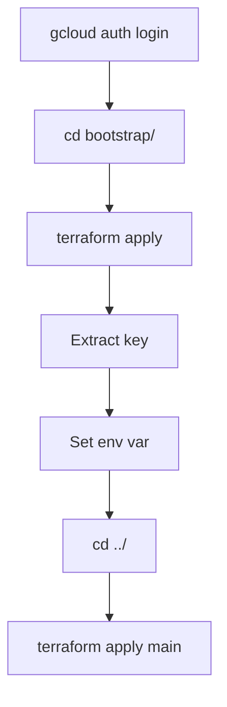

# Terraform Bootstrap - Service Account Setup

## 🎯 **Purpose**

Automated Terraform configuration to create GCP service account with required permissions for main infrastructure deployment.

---

## 📂 **Directory Structure**

```
terraform/
├── bootstrap/           ← Run this FIRST
│   ├── main.tf
│   ├── terraform.tfvars.example
│   ├── terraform.tfvars
│   └── .gitignore
│
├── main.tf             ← Run this SECOND (main infrastructure)
├── gcp_log_sink_pubsub.tf
├── terraform.tfvars.example
└── README.md
```

---

## 🔐 **Prerequisites - User Permissions**

### **Who Can Run Bootstrap?**

The user running bootstrap Terraform needs IAM permissions to:
- Create service accounts
- Grant IAM roles
- Create service account keys

### **Required Roles**

**Option 1: Owner Role (Recommended)**
```bash
roles/owner
```
✅ Has all required permissions

**Option 2: Minimum Required Roles**
```bash
roles/iam.serviceAccountAdmin
roles/resourcemanager.projectIamAdmin
```

### **Check Your Permissions**
```bash
# Check if you have required roles
gcloud projects get-iam-policy PROJECT_ID \
  --flatten="bindings[].members" \
  --filter="bindings.members:user:$(gcloud config get-value account)" \
  --format="value(bindings.role)"
```

**Expected Output:**
- `roles/owner` ✅
- OR both `roles/iam.serviceAccountAdmin` AND `roles/resourcemanager.projectIamAdmin` ✅

### **If You Don't Have Permissions**

Ask your GCP project owner to grant:
```bash
# Grant Service Account Admin
gcloud projects add-iam-policy-binding PROJECT_ID \
  --member="user:YOUR_EMAIL@example.com" \
  --role="roles/iam.serviceAccountAdmin"

# Grant Project IAM Admin
gcloud projects add-iam-policy-binding PROJECT_ID \
  --member="user:YOUR_EMAIL@example.com" \
  --role="roles/resourcemanager.projectIamAdmin"
```

### **Specific Permissions Required**
```
iam.serviceAccounts.create
iam.serviceAccounts.get
iam.serviceAccountKeys.create
resourcemanager.projects.getIamPolicy
resourcemanager.projects.setIamPolicy
```

---

## 🚀 **Usage**

### **Step 1: Bootstrap (Creates Service Account)**

```bash
cd terraform/bootstrap/

# Configure
cp terraform.tfvars.example terraform.tfvars
# Edit: gcp_project_id = "your-project"

# Deploy
terraform init
terraform apply

# Extract key
terraform output -raw service_account_key_file_content > terraform-sa-key.json

# Set credential
export GOOGLE_APPLICATION_CREDENTIALS="$(pwd)/terraform-sa-key.json"
```

### **Step 2: Main Infrastructure (Uses Service Account)**

```bash
cd ..  # Back to main terraform directory

# Configure
cp terraform.tfvars.example terraform.tfvars
# Edit with your settings

# Deploy
terraform init
terraform apply
```

---

## 📋 **Resources Created**

### **Service Account**
```hcl
resource "google_service_account" "terraform_deployer"
```
- **ID:** `terraform-deployer`
- **Email:** `terraform-deployer@PROJECT_ID.iam.gserviceaccount.com`

### **IAM Bindings (5 roles)**
```hcl
resource "google_project_iam_member"
```
- `roles/logging.admin` - Create log sinks
- `roles/pubsub.admin` - Create Pub/Sub topics/subscriptions
- `roles/iam.serviceAccountAdmin` - Create OIDC service account
- `roles/iam.serviceAccountUser` - Use service accounts
- `roles/resourcemanager.projectIamAdmin` - Grant IAM permissions

### **Service Account Key**
```hcl
resource "google_service_account_key" "terraform_deployer_key"
```
- JSON key (base64 encoded in state)
- Extract via: `terraform output -raw service_account_key_file_content`

---

## 🔧 **Configuration Variables**

### **terraform.tfvars**
```hcl
gcp_project_id     = "your-project-id"          # Required
gcp_region         = "us-central1"              # Optional (default: us-central1)
service_account_id = "terraform-deployer"       # Optional (default: terraform-deployer)
```

---

## 📤 **Outputs**

### **Available Outputs**

```bash
# Service account email
terraform output service_account_email

# Service account ID
terraform output service_account_id

# Key file content (base64 decoded)
terraform output -raw service_account_key_file_content

# Instructions
terraform output instructions

# Roles granted
terraform output roles_granted
```

### **Extract Key to File**
```bash
terraform output -raw service_account_key_file_content > terraform-sa-key.json
```

---

## 🔐 **Authentication Flow**

### **Bootstrap Phase**
```
Your User Credentials (Owner/Editor)
    ↓
gcloud auth application-default login
    ↓
Terraform Bootstrap
    ↓
Creates Service Account + Key
```

### **Main Infrastructure Phase**
```
Service Account Key (terraform-sa-key.json)
    ↓
GOOGLE_APPLICATION_CREDENTIALS env var
    ↓
Main Terraform
    ↓
Deploys GCP → AWS Infrastructure
```

---

## 🔄 **Workflow**



---

## 📝 **Prerequisites Summary**

1. **Terraform:** >= 1.0
2. **gcloud CLI:** For initial authentication
3. **GCP User Permissions:** 
   - `roles/owner` (recommended)
   - OR `roles/iam.serviceAccountAdmin` + `roles/resourcemanager.projectIamAdmin`

---

## 🛠️ **Commands Reference**

### **Bootstrap Commands**
```bash
cd terraform/bootstrap/

# Initialize
terraform init

# Plan
terraform plan

# Apply
terraform apply

# Extract key
terraform output -raw service_account_key_file_content > terraform-sa-key.json

# View service account
terraform output service_account_email

# Destroy (if needed)
terraform destroy
```

### **Environment Variable**
```bash
# Linux/Mac
export GOOGLE_APPLICATION_CREDENTIALS="$(pwd)/terraform-sa-key.json"

# Windows PowerShell
$env:GOOGLE_APPLICATION_CREDENTIALS="$pwd\terraform-sa-key.json"

# Windows CMD
set GOOGLE_APPLICATION_CREDENTIALS=%cd%\terraform-sa-key.json
```

---

## 🔍 **Terraform State**

### **Bootstrap State**
- Location: `terraform/bootstrap/terraform.tfstate`
- Contains: Service account details, IAM bindings
- **Sensitive:** Contains private key (base64 encoded)

### **Security**
- `.gitignore` prevents commit of:
  - `terraform.tfstate`
  - `*.json` (key files)
  - `terraform.tfvars`

---

## 🧪 **Testing**

### **Verify Service Account Created**
```bash
# Via Terraform
terraform show | grep email

# Via gcloud
gcloud iam service-accounts list --filter="email:terraform-deployer@*"
```

### **Verify Permissions**
```bash
gcloud projects get-iam-policy PROJECT_ID \
  --flatten="bindings[].members" \
  --filter="bindings.members:serviceAccount:terraform-deployer@*"
```

### **Verify Key Works**
```bash
# Set credential
export GOOGLE_APPLICATION_CREDENTIALS="terraform-sa-key.json"

# Test with gcloud
gcloud auth activate-service-account --key-file=terraform-sa-key.json

# Test with Terraform
cd ../
terraform init  # Should work without errors
```

---

## 🔄 **Updating Service Account**

### **Add New Role**
Edit `main.tf`:
```hcl
resource "google_project_iam_member" "new_role" {
  project = var.gcp_project_id
  role    = "roles/compute.admin"
  member  = "serviceAccount:${google_service_account.terraform_deployer.email}"
}
```

Apply:
```bash
terraform apply
```

### **Rotate Key**
```bash
# Destroy old key
terraform destroy -target=google_service_account_key.terraform_deployer_key

# Create new key
terraform apply

# Extract new key
terraform output -raw service_account_key_file_content > terraform-sa-key.json
```

---

## 🗑️ **Cleanup**

### **Destroy Service Account**
```bash
cd terraform/bootstrap/
terraform destroy
```

**Warning:** This revokes all Terraform access. Use only when:
- Testing complete
- Moving to different setup
- Security incident

---

## 🐛 **Troubleshooting**

### **Error: "Permission denied" during apply**
**Cause:** Personal account lacks required permissions

**Solution:** Verify you have required roles
```bash
gcloud projects get-iam-policy PROJECT_ID \
  --flatten="bindings[].members" \
  --filter="bindings.members:user:$(gcloud config get-value account)" \
  --format="value(bindings.role)"
```

**Required:**
- `roles/owner`
- OR `roles/iam.serviceAccountAdmin` + `roles/resourcemanager.projectIamAdmin`

**If missing, ask project owner to grant permissions (see Prerequisites section)**

### **Error: "Service account already exists"**
**Solution 1 - Import:**
```bash
terraform import google_service_account.terraform_deployer \
  projects/PROJECT_ID/serviceAccounts/terraform-deployer@PROJECT_ID.iam.gserviceaccount.com
```

**Solution 2 - Change ID:**
```hcl
service_account_id = "terraform-deployer-v2"
```

### **Error: "Key file not found" in main terraform**
**Cause:** Environment variable not set  
**Solution:**
```bash
# Verify variable
echo $GOOGLE_APPLICATION_CREDENTIALS

# Set with absolute path
export GOOGLE_APPLICATION_CREDENTIALS="/full/path/to/terraform-sa-key.json"
```

---

## 📊 **Provider Configuration**

### **Bootstrap provider.tf (uses personal credentials)**
```hcl
provider "google" {
  project = var.gcp_project_id
  region  = var.gcp_region
  # Uses: gcloud auth application-default credentials
}
```

### **Main provider.tf (uses service account)**
```hcl
provider "google" {
  project = var.gcp_project_id
  region  = var.gcp_region
  # Uses: GOOGLE_APPLICATION_CREDENTIALS env var
}
```

---

## 🔑 **Key Takeaways**

1. **Bootstrap = Setup** - Creates service account for main deployment
2. **Run Once** - Service account persists, reuse for all deployments
3. **Two-Phase Auth** - Personal creds for bootstrap, service account for main
4. **IaC Benefits** - Reproducible, version-controlled, auditable
5. **State Management** - Keep bootstrap state separate from main state

---

## 📁 **File Locations**

```
terraform/bootstrap/
├── main.tf                      # Service account resources
├── terraform.tfvars.example     # Example configuration
├── terraform.tfvars             # Your configuration (gitignored)
├── .gitignore                   # Protects sensitive files
├── terraform.tfstate            # State file (gitignored)
└── terraform-sa-key.json        # Generated key (gitignored)
```

---

## ⚡ **Quick Reference**

```bash
# Bootstrap (one-time setup)
cd bootstrap && terraform apply && \
  terraform output -raw service_account_key_file_content > terraform-sa-key.json && \
  export GOOGLE_APPLICATION_CREDENTIALS="$(pwd)/terraform-sa-key.json"

# Main infrastructure (repeatable)
cd .. && terraform apply
```

---

**Purpose:** Automate GCP service account creation via Terraform  
**Use Case:** CI/CD pipelines, team environments, repeatable deployments  
**Next Step:** See README.md for main infrastructure deployment
