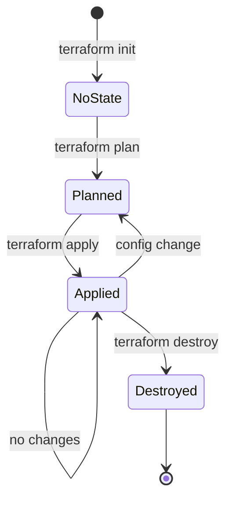

# Terraform Architecture for Agent Environment Variable Management

## System Overview

```
┌─────────────────────────────────────────────────────────────┐
│                    Developer Workstation                     │
│                                                              │
│  ┌────────────────────────────────────────────────────┐   │
│  │             terraform/terraform.tfvars             │   │
│  │  - Agent IDs                                       │   │
│  │  - Environment Variables                           │   │
│  │  - OTEL endpoints                                  │   │
│  │  - Resource attributes                             │   │
│  │  - Trigger flags                                   │   │
│  └────────────────┬───────────────────────────────────┘   │
│                   │                                          │
│                   │ terraform apply                          │
│                   ▼                                          │
│  ┌────────────────────────────────────────────────────┐   │
│  │             Terraform (main.tf)                    │   │
│  │  1. Read configuration                             │   │
│  │  2. Update .env files                              │   │
│  │  3. Optionally trigger redeployment                │   │
│  └────────────────┬───────────────────────────────────┘   │
│                   │                                          │
└───────────────────┼──────────────────────────────────────────┘
                    │
       ┌────────────┴────────────┐
       │                         │
       ▼                         ▼
┌──────────────────┐    ┌──────────────────┐
│ portal26_ngrok_  │    │ portal26_otel_   │
│ agent/.env       │    │ agent/.env       │
│                  │    │                  │
│ OTEL_ENDPOINT=   │    │ OTEL_ENDPOINT=   │
│ SERVICE_NAME=    │    │ SERVICE_NAME=    │
│ RESOURCE_ATTRS=  │    │ RESOURCE_ATTRS=  │
└────────┬─────────┘    └────────┬─────────┘
         │                       │
         │ (if trigger_redeploy=true)
         │                       │
         ▼                       ▼
┌──────────────────┐    ┌──────────────────┐
│ python -m        │    │ python -m        │
│ google.adk.cli   │    │ google.adk.cli   │
│ deploy ...       │    │ deploy ...       │
└────────┬─────────┘    └────────┬─────────┘
         │                       │
         │                       │
         ▼                       ▼
┌────────────────────────────────────────────┐
│     Vertex AI Agent Engine (GCP)           │
│                                             │
│  ┌────────────┐      ┌────────────┐       │
│  │ Agent 1    │      │ Agent 2    │       │
│  │ 2658127... │      │ 7483734... │       │
│  │            │      │            │       │
│  │ Updated    │      │ Updated    │       │
│  │ env vars   │      │ env vars   │       │
│  └─────┬──────┘      └─────┬──────┘       │
│        │                   │               │
└────────┼───────────────────┼───────────────┘
         │ OTLP/HTTP         │ OTLP/HTTP
         │ Telemetry         │ Telemetry
         ▼                   ▼
┌──────────────┐    ┌──────────────────┐
│ ngrok →      │    │ Portal26 Direct  │
│ Local →      │    │ Endpoint         │
│ Portal26     │    │                  │
└──────────────┘    └──────────────────┘
```

## Configuration Flow

### 1. Edit Configuration

```hcl
# terraform/terraform.tfvars

portal26_ngrok_agent_env_vars = {
  otel_endpoint = "https://new-endpoint.ngrok.dev"  # Changed
  # ...
}

trigger_redeploy = true  # Enable redeployment
```

### 2. Terraform Processing

```
terraform apply
     │
     ├─► Read terraform.tfvars
     ├─► Validate configuration
     ├─► Calculate changes (plan)
     ├─► Update .env files (always)
     │
     └─► If trigger_redeploy=true:
         └─► Execute: python -m google.adk.cli deploy ...
```

### 3. Agent Deployment

```
Agent Package Upload
     │
     ├─► GCP Cloud Build
     ├─► Package compilation
     ├─► Environment variables injected
     ├─► Container creation
     │
     └─► Reasoning Engine deployed
         └─► agent.py executes
             └─► trace.set_tracer_provider()
                 └─► Custom OTEL exporter initialized
```

## State Management

### Terraform State

```
.terraform/
├── terraform.tfstate        # Current state
├── terraform.tfstate.backup # Previous state
└── providers/               # Provider binaries
```

**What Terraform Tracks:**
- `.env` file contents
- Last applied configuration
- Resource triggers
- Output values

**What Terraform Doesn't Track:**
- Actual GCP agent deployment status
- OTEL telemetry flow
- Agent execution state

### State Transitions



## Variable Precedence

1. **Command line** (`-var="name=value"`)
2. **terraform.tfvars** (your configuration)
3. **Environment variables** (`TF_VAR_name`)
4. **variables.tf defaults**

Example:
```bash
# Override in command line
terraform apply -var="trigger_redeploy=true"

# Or use environment variable
export TF_VAR_trigger_redeploy=true
terraform apply
```

## Trigger Mechanism

### trigger_redeploy Flag

```hcl
trigger_redeploy = false  # Default - only update .env files
```

```hcl
trigger_redeploy = true   # Enable - update .env AND redeploy
```

**How it works:**

```terraform
resource "null_resource" "redeploy_portal26_ngrok_agent" {
  count = var.trigger_redeploy ? 1 : 0  # Create only if true

  triggers = {
    env_file_content = local_file.portal26_ngrok_agent_env.content
  }

  provisioner "local-exec" {
    command = "python -m google.adk.cli deploy ..."
  }
}
```

**When count = 0**: Resource doesn't exist, no deployment
**When count = 1**: Resource exists, deployment triggered

## Resource Dependencies

```
terraform.tfvars
      │
      ▼
local_file.portal26_ngrok_agent_env (always created)
      │
      ├─► ../portal26_ngrok_agent/.env
      │
      └─► depends_on
          │
          ▼
null_resource.redeploy_portal26_ngrok_agent (conditional)
      │
      └─► python -m google.adk.cli deploy ...
```

## Update Scenarios

### Scenario 1: Update Without Redeployment

```
User Action: Edit terraform.tfvars, keep trigger_redeploy=false
     │
     ▼
terraform apply
     │
     ├─► Update .env files ✅
     ├─► Skip deployment ⏭️
     └─► State updated ✅

Result: .env files updated, agents unchanged
Use Case: Testing configuration before deploying
```

### Scenario 2: Update With Redeployment

```
User Action: Edit terraform.tfvars, set trigger_redeploy=true
     │
     ▼
terraform apply
     │
     ├─► Update .env files ✅
     ├─► Trigger deployment ✅
     │   └─► Upload package
     │       └─► GCP builds
     │           └─► Agent deployed (2-3 min)
     └─► State updated ✅

Result: .env files updated, agents redeployed with new config
Use Case: Applying configuration to production
```

### Scenario 3: Reset Trigger

```
User Action: Set trigger_redeploy=false after deployment
     │
     ▼
terraform apply
     │
     ├─► No .env changes (already applied)
     ├─► Remove deployment resource
     └─► State updated ✅

Result: Cleanup state, ready for next update
Use Case: Reset to stable state
```

## Multi-Agent Management

### Independent Agents

Each agent is managed independently:

```terraform
# Agent 1
resource "local_file" "portal26_ngrok_agent_env" { ... }
resource "null_resource" "redeploy_portal26_ngrok_agent" { ... }

# Agent 2
resource "local_file" "portal26_otel_agent_env" { ... }
resource "null_resource" "redeploy_portal26_otel_agent" { ... }
```

**Benefits:**
- Update one agent without affecting the other
- Different trigger states per agent
- Independent deployment timing

**Example:**
```hcl
# Update only ngrok agent
portal26_ngrok_agent_env_vars = {
  otel_endpoint = "https://new-endpoint.ngrok.dev"  # Changed
}

# Keep otel agent unchanged
portal26_otel_agent_env_vars = {
  # ... no changes
}

trigger_redeploy = true  # Applies to both, but only ngrok changed
```

Result: Only ngrok agent redeployed (otel agent .env updated but no actual change, so no redeploy needed).

## Error Handling

### Deployment Failures

```
terraform apply
     │
     └─► local-exec provisioner fails
         │
         ├─► Terraform marks resource as tainted
         ├─► Next apply will retry
         └─► Manual intervention may be needed
```

**Recovery:**

```bash
# Option 1: Fix issue and retry
terraform apply

# Option 2: Manually complete deployment
python -m google.adk.cli deploy agent_engine portal26_ngrok_agent \
  --project ... --region ... --agent_engine_id ...

# Option 3: Remove tainted resource
terraform state rm null_resource.redeploy_portal26_ngrok_agent
```

## Security Architecture

### Protected Files (.gitignore)

```
terraform.tfvars        ← Contains your config (may have sensitive values)
*.tfstate*              ← Contains state with resource details
.terraform/             ← Provider binaries
temp_*.json             ← Temporary files
```

### Git Repository

```
main.tf                 ✅ Committed (structure)
variables.tf            ✅ Committed (definitions)
terraform.tfvars.example ✅ Committed (template)
terraform.tfvars        ❌ Ignored (your config)
.terraform/             ❌ Ignored (binaries)
*.tfstate              ❌ Ignored (state)
```

### Access Control

```
Terraform execution
     │
     ├─► Uses: gcloud auth application-default
     │
     └─► Requires IAM roles:
         ├─► Vertex AI User (to deploy)
         ├─► Storage Admin (for packages)
         └─► Service Account User (for execution)
```

## Performance Considerations

### Terraform Operations

| Operation | Time | Impact |
|-----------|------|--------|
| `terraform init` | 5-30s | Downloads providers |
| `terraform plan` | 1-5s | Calculates changes |
| `terraform apply` (no deployment) | 1-5s | Updates .env files |
| `terraform apply` (with deployment) | 2-5 min | Deploys agents |

### Optimization Tips

1. **Separate plan and apply**: Review changes before applying
2. **Update one agent at a time**: Reduce deployment time
3. **Test without redeployment**: Set trigger_redeploy=false first
4. **Use workspaces**: Manage multiple environments

## Monitoring and Validation

### Terraform Outputs

```bash
terraform output portal26_ngrok_agent_id
terraform output portal26_ngrok_agent_env_file
```

### Validation Pipeline

```
1. terraform validate  # Check syntax
2. terraform plan      # Preview changes
3. terraform apply     # Apply changes
4. Check .env files    # Verify file updates
5. Check logs          # Verify deployment
6. Test agents         # Verify functionality
7. Check telemetry     # Verify OTEL flow
```

## CI/CD Integration

### GitHub Actions Example

```yaml
name: Update Agent Configuration

on:
  push:
    paths:
      - 'terraform/terraform.tfvars'

jobs:
  terraform:
    steps:
      - uses: actions/checkout@v3
      - uses: hashicorp/setup-terraform@v2

      - name: Terraform Init
        run: terraform init
        working-directory: terraform

      - name: Terraform Plan
        run: terraform plan
        working-directory: terraform

      - name: Terraform Apply
        run: terraform apply -auto-approve
        working-directory: terraform

      - name: Verify Deployment
        run: python test_tracer_provider.py
```

## Best Practices

1. **Always run plan first**: `terraform plan` before `apply`
2. **Use version control**: Commit terraform files (except .tfvars)
3. **Document changes**: Add comments in terraform.tfvars
4. **Test incrementally**: Update one agent at a time
5. **Verify before production**: Test with trigger_redeploy=false first
6. **Backup state**: Keep .tfstate backups (or use remote state)
7. **Review logs**: Check GCP logs after deployment
8. **Monitor telemetry**: Verify OTEL data after changes

---

**Status**: Production Ready
**Last Updated**: 2026-03-30
