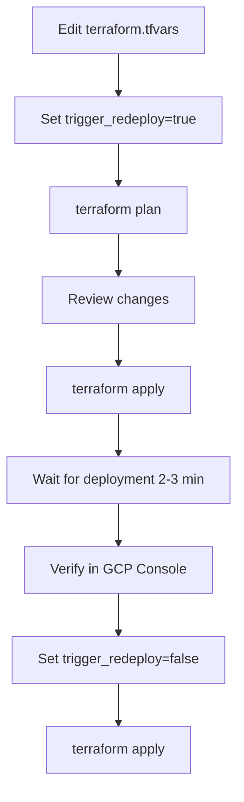
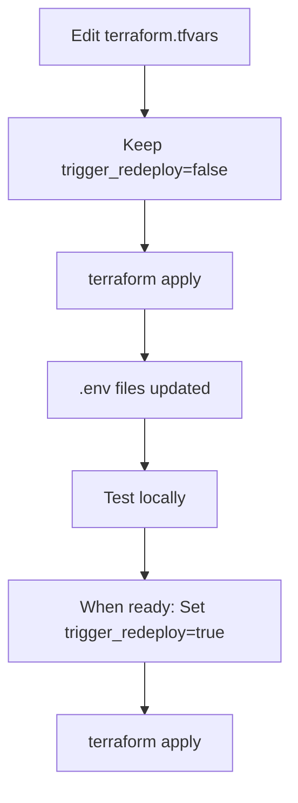

# Terraform Guide - Updating Agent Environment Variables

## Quick Start

### Windows
```cmd
cd terraform
quickstart.bat init
quickstart.bat check
quickstart.bat plan
quickstart.bat apply
```

### Linux/Mac
```bash
cd terraform
chmod +x quickstart.sh
./quickstart.sh init
./quickstart.sh check
./quickstart.sh plan
./quickstart.sh apply
```

## Common Tasks

### 1. Update ngrok Endpoint

**terraform.tfvars:**
```hcl
portal26_ngrok_agent_env_vars = {
  telemetry_enabled   = "true"
  otel_endpoint       = "https://NEW-ngrok-url.ngrok-free.dev"  # Update this
  service_name        = "portal26_ngrok_agent"
  resource_attributes = "portal26.tenant_id=tenant1,portal26.user.id=relusys,agent.type=ngrok-local"
}

trigger_redeploy = true  # Enable redeployment
```

**Apply:**
```bash
terraform apply
```

**After deployment completes:**
```hcl
trigger_redeploy = false  # Disable trigger
```

```bash
terraform apply
```

### 2. Update Resource Attributes

Add or modify resource attributes for better telemetry filtering:

```hcl
portal26_ngrok_agent_env_vars = {
  telemetry_enabled   = "true"
  otel_endpoint       = "https://tabetha-unelemental-bibulously.ngrok-free.dev"
  service_name        = "portal26_ngrok_agent"
  resource_attributes = "portal26.tenant_id=tenant2,portal26.user.id=newuser,agent.type=ngrok-local,environment=staging,version=1.2.3"
}
```

### 3. Update Portal26 Direct Endpoint

```hcl
portal26_otel_agent_env_vars = {
  telemetry_enabled   = "true"
  otel_endpoint       = "https://otel-tenant2.portal26.in:4318"  # New endpoint
  service_name        = "portal26_otel_agent"
  resource_attributes = "portal26.tenant_id=tenant2,portal26.user.id=relusys,agent.type=otel-direct"
}

trigger_redeploy = true
```

### 4. Enable/Disable Telemetry

```hcl
portal26_ngrok_agent_env_vars = {
  telemetry_enabled   = "false"  # Disable telemetry
  # ... other vars
}
```

### 5. View Current Configuration

**Windows:**
```cmd
quickstart.bat status
```

**Linux/Mac:**
```bash
./quickstart.sh status
```

**Or directly:**
```bash
cat ../portal26_ngrok_agent/.env
cat ../portal26_otel_agent/.env
```

## Workflow

### Standard Update Flow



### Testing Flow (No Redeployment)



## File Structure

```
terraform/
├── main.tf                      # Main configuration
├── variables.tf                 # Variable definitions
├── terraform.tfvars.example     # Example variables
├── terraform.tfvars            # Your variables (gitignored)
├── .gitignore                  # Ignore sensitive files
├── README.md                   # Full documentation
├── TERRAFORM_GUIDE.md          # This file
├── rest_api_approach.tf.example # Alternative REST API approach
├── quickstart.sh               # Quick start script (Linux/Mac)
└── quickstart.bat              # Quick start script (Windows)
```

## Environment Variables Reference

| Variable | Description | Example |
|----------|-------------|---------|
| `GOOGLE_CLOUD_PROJECT` | GCP Project ID | `agentic-ai-integration-490716` |
| `GOOGLE_CLOUD_LOCATION` | GCP Region | `us-central1` |
| `GOOGLE_CLOUD_AGENT_ENGINE_ENABLE_TELEMETRY` | Enable telemetry | `true` |
| `OTEL_EXPORTER_OTLP_ENDPOINT` | OTLP endpoint URL | `https://your-endpoint.com` |
| `OTEL_SERVICE_NAME` | Service name for telemetry | `portal26_ngrok_agent` |
| `OTEL_RESOURCE_ATTRIBUTES` | Custom resource attributes | `key1=value1,key2=value2` |

## Resource Attributes Examples

### Multi-tenant Setup
```hcl
resource_attributes = "portal26.tenant_id=tenant1,portal26.user.id=user123,agent.type=production"
```

### Environment Tracking
```hcl
resource_attributes = "portal26.tenant_id=tenant1,environment=staging,version=2.0.0,region=us-east"
```

### Team/Department Tracking
```hcl
resource_attributes = "portal26.tenant_id=tenant1,team=engineering,department=ai,cost_center=1234"
```

## Verification

### 1. Check Agent Logs

```bash
gcloud logging read "resource.type=\"aiplatform.googleapis.com/ReasoningEngine\" \
  AND resource.labels.reasoning_engine_id=\"2658127084508938240\" \
  AND textPayload=~\"OTEL_INIT\"" \
  --limit 5 \
  --project agentic-ai-integration-490716
```

Expected output:
```
[OTEL_INIT] Setting custom tracer provider for endpoint: https://...
[OTEL_INIT] Custom tracer provider set successfully!
```

### 2. Test Agent Execution

```bash
cd ..
python test_tracer_provider.py
```

### 3. Check Local Telemetry

```bash
ls -lh otel-data/
tail -100 otel-data/traces_*.log
```

### 4. Verify in GCP Console

Navigate to:
- Vertex AI > Agent Engine > Your Agent > Deployment details
- Check "Environment" section for updated variables

## Troubleshooting

### Terraform state locked

```bash
# Remove lock
terraform force-unlock LOCK_ID

# Or refresh state
terraform refresh
```

### Deployment fails

Check logs:
```bash
gcloud logging read "resource.type=\"aiplatform.googleapis.com/ReasoningEngine\" \
  AND resource.labels.reasoning_engine_id=\"YOUR_AGENT_ID\" \
  AND severity>=ERROR" \
  --limit 20 \
  --project agentic-ai-integration-490716
```

### Environment variables not applied

Remember: Environment variables require agent redeployment to take effect.

1. Verify .env file is updated
2. Set `trigger_redeploy = true`
3. Run `terraform apply`
4. Wait 2-3 minutes for deployment
5. Verify in GCP Console

### Can't find agent ID

```bash
gcloud ai reasoning-engines list \
  --location=us-central1 \
  --project=agentic-ai-integration-490716
```

## Best Practices

1. **Version Control**: Commit `main.tf`, `variables.tf` but NOT `terraform.tfvars`
2. **Review Changes**: Always run `terraform plan` before `apply`
3. **Incremental Updates**: Update one agent at a time
4. **Verify First**: Set `trigger_redeploy=false` first, verify .env files, then enable
5. **Backup**: Keep backup of working `terraform.tfvars`
6. **Documentation**: Document why you changed values

## Example: Complete Update Workflow

```bash
# 1. Edit configuration
nano terraform.tfvars

# Update ngrok endpoint:
portal26_ngrok_agent_env_vars = {
  otel_endpoint = "https://new-endpoint.ngrok-free.dev"
  # ... other vars
}
trigger_redeploy = true

# 2. Preview changes
terraform plan

# 3. Apply if looks good
terraform apply

# 4. Wait for deployment (2-3 minutes)
# Watch progress in GCP Console

# 5. Verify
gcloud logging read "..." --limit 5

# 6. Test
cd ..
python test_tracer_provider.py

# 7. Disable trigger
# Edit terraform.tfvars:
trigger_redeploy = false

# 8. Apply to update state
terraform apply
```

## CI/CD Integration

See `README.md` for GitHub Actions workflow example.

## Support Resources

- **Full Documentation**: `README.md`
- **Deployment Guide**: `../DEPLOYMENT_SUCCESS.md`
- **Project Status**: `../FINAL_STATUS.md`
- **Vertex AI Docs**: https://cloud.google.com/vertex-ai/docs/agent-engine

## Quick Reference

```bash
# Initialize
terraform init

# Check what would change
terraform plan

# Apply changes
terraform apply

# View outputs
terraform output

# Show current state
terraform show

# List resources
terraform state list

# Refresh state from GCP
terraform refresh

# Format code
terraform fmt

# Validate config
terraform validate
```
